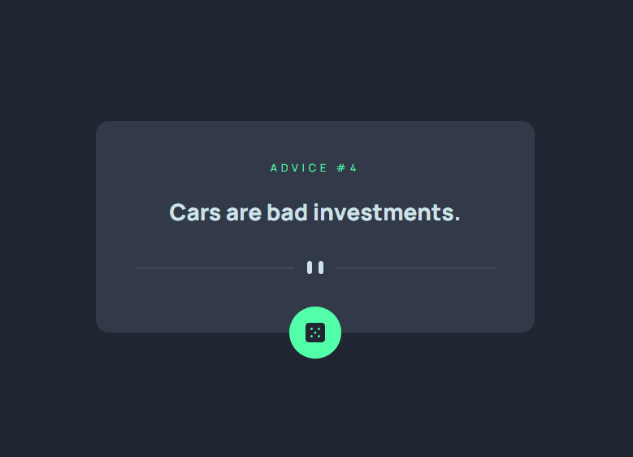

# Advice generator app

This is a solution to the [Advice generator app challenge on Frontend Mentor](https://www.frontendmentor.io/challenges/advice-generator-app-QdUG-13db). 

## Table of Contents

- [Overview](#overview)
- [Features](#features)
- [Demo](#demo)
- [Usage](#usage)
- [Built With](#built-with)
- [Contributing](#contributing)
- [License](#license)

## Overview

This project is a solution to the Advice Generator App challenge provided by Frontend Mentor. Users should be able to:
- View the optimal layout for the app depending on their device's screen size
- See hover states for all interactive elements on the page
- Generate a new piece of advice by clicking the dice icon

## Features

- Responsive design suitable for various screen sizes.
- Generates new advice from the [Advice Slip API](https://api.adviceslip.com) upon clicking the dice icon.

## Demo

## Usage

1. Clone the repository:

git clone https://github.com/GrzegorzPacewicz/advice-generator

Open the index.html file in your browser to view the project locally.

## Built With

This project is built using the following technologies:

- **HTML:** Used to structure the web page and provide semantic markup.
- **React:** Utilized for creating dynamic and interactive user interfaces. React components are employed to encapsulate the rating functionality, making it modular and reusable.
- **CSS Modules:** Employed for styling the components in a modular and scoped manner. CSS Modules help in preventing class name collisions and maintainability by keeping styles localized to their respective components.

## Contributing
Contributions are welcome! If you'd like to contribute to this project, feel free to fork this repository, make your changes, and submit a pull request.

## License
This project is licensed under the MIT License.

